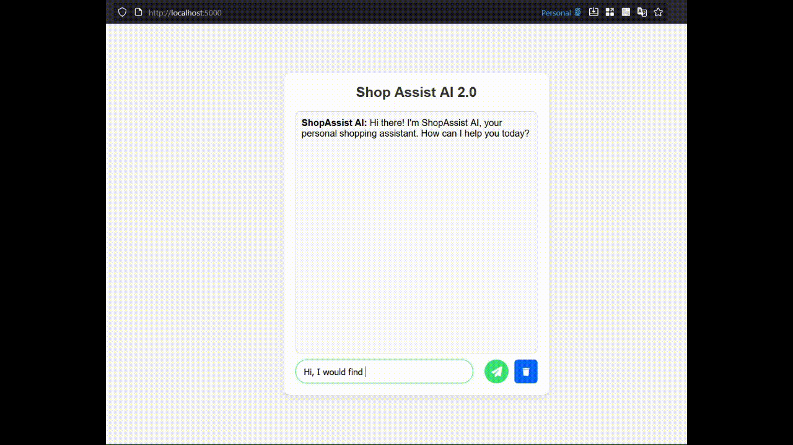

# 🧠 ShopAssist AI 2.0

ShopAssist AI 2.0 is an enhanced conversational assistant built with Flask and OpenAI Function Calling API.  
It provides intelligent, data-driven product recommendations through natural conversation.

---
Repo: https://github.com/lacusu/ShopAssistAI
---
## 🎬 Demo

Here’s a short demonstration of the chatbot in action:



> The demo shows real-time interaction between the user and AI, including typing delay, recommendations, and context reset.

---

## Features
- Uses OpenAI `gpt-4o-mini` with function calling.
- Multi-turn conversation memory using Flask-Session.
- Loads real dataset (`updated_laptop.csv`) directly with pandas.
- Supports flexible filtering: category, brand, CPU, RAM, GPU, OS, and price range.
- Clean web interface with "Clear" button.
- Modular, production-ready Flask project structure.

---

## Project Structure
```
ShopAssistAI/
├── run.py
├── .env
├── requirements.txt
│
├── app/
│ ├── __init__.py
│ ├── routes.py
│ ├── config/
│ │ └── settings.py
│ ├── services/
│ │ ├── openai_service.py
│ │ ├── functions_schema.py
│ │ ├── product_service.py
│ │ └── conversation_service.py
│ ├── templates/
│ │ └── index.html
│ ├── static/
│ │ ├── style.css
│ │ └── script.js
│ └── data/
│ └── updated_laptop.csv
└── README.md
```
## Setup and Run

1. **Create a virtual environment**
   ```bash
   python -m venv venv
   # Mac/Linux
   source venv/bin/activate   
   # Windows
   venv\Scripts\activate      
   ```
2. **Install dependencies**
   ```bash
   pip install -r requirements.txt
   ```
3. Set up environment variables

   Edit .env.example in the project root and rename it to .env
    ```bash
   OPENAI_API_KEY=your-api-key-here
   SECRET_KEY=your-flask-secret-key-here
   MODEL_NAME=gpt-4o-mini
    ```
4. Run the app
   ```bash
   python run.py
   ```
5. Open in browser
   ```bash
   http://127.0.0.1:5000
   ```
---
## 📘 Project Report

A detailed report is available here:  
📄 [**Download ShopAssist_AI_2_Report.pdf**](docs/ShopAssist_AI_2_Report.pdf)
